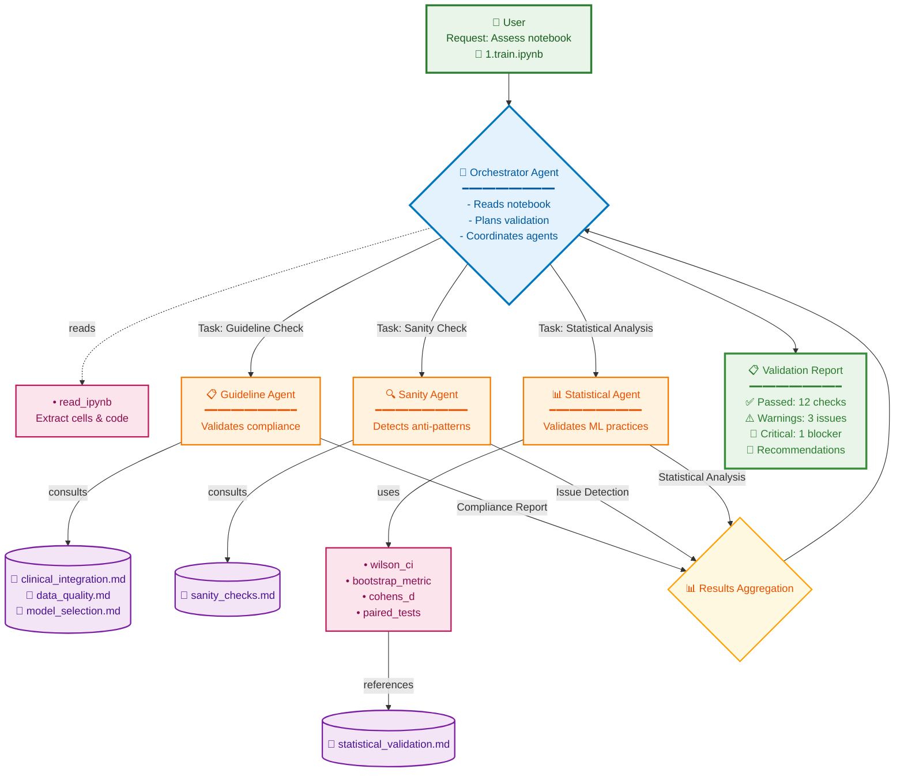

# Clinical AI Guardrails

[](https://www.python.org/downloads/)
[](https://github.com/Valavanca/clinical-ai-guardrails)

A lightweight validation/testing workflow that runs alongside your codebase. AI agents review notebooks (or other files) and test them against written guidelines.

### Agent Architecture



- **Orchestrator Agent**: Receives notebook path, reads content, plans tasks, delegates to specialized agents, and aggregates results
- **Guideline Agent**: Validates against clinical guidelines and internal documentation (conservative approach)  
- **Sanity Agent**: Applies generic high-level checks and flags common failures or violations
- **Statistical Agent**: Validates ML/statistical best practices for small clinical datasets using specialized tools


## Installation
```bash
cd clinical-ai-guardrails
uv sync
```


## Quick Start
```python
from tests.orchestrator.agent import get_system

system = get_system()
system.run_validation(
    "Assess `src/clinical_ai_guardrails/notebooks/1.train.ipynb`",
    max_steps=6
)
```

> [!NOTE]  
> By default, the system uses **OpenAI API** (gpt-5-nano). Create a `.env` file with your API key:
> 
> ```bash
> OPENAI_API_KEY=your_api_key_here
> ```
> 
> Alternative providers or local models can also be configured via LiteLLM (`LiteLLMModel`).